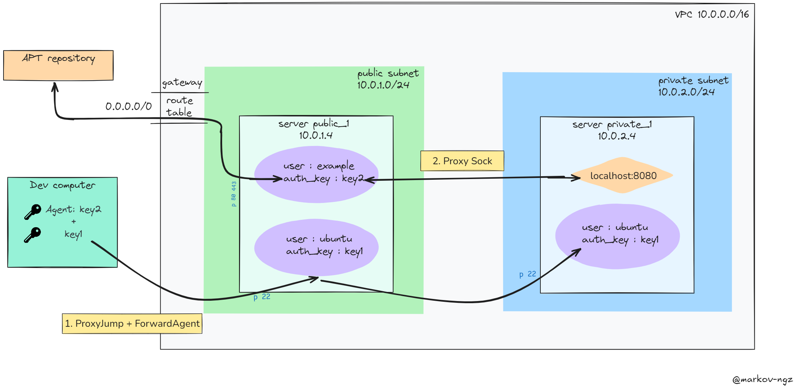

# SSH : proxy socks

Repository dedicated to the package update of a server in a private network by proxying another in a public network. <br>
This work is intended as an introduction of using SSH in order to setup a Bastion .  

## Executive summary Schema


## Steps 
### 1. Build the infrastructure (AWS provider)
Create the ssh_keys
```
ssh-keygen -t rsa -b 2048 -f <key_name>
```
Set up the following env variable : 
```
export  TF_VAR_public_ip = $(curl -s ifconfig.me) 
export  TF_VAR_key_name = 
export  TF_VAR_key_path = 
```
Create Cloud Resources 
```
cd terraform
terraform init
terraform apply -auto-approve
```


### 2. Configure your .ssh/config file 
`nano .ssh/config` <br>
And adjust the following code 
```
Host *
    ForwardAgent yes

Host public_1
    Hostname <aws_instance_public_ip>
    User ubuntu
    IdentityFile <key_path>
    Port 22

Host private_1
    Hostname 10.0.2.4
    User ubuntu
    IdentityFile <key_path>
    Port 22
    ProxyJump public_1
```

### 3. Setup SSH Agent
#### 3.1 Activate the ssh-agent service
Check if an agent is not already present 
```
echo $ SSH_AGENT_PID
```
Activate ssh-agent 
```
eval `ssh-agent`
```
-> Environment Variable $SSH_AGENT_PID should be set
#### 3.2 Add a key to the agent
Create another key
```
ssh-keygen -t ecdsa -b 521 -f <private_key_path>
```
Add it 
```
ssh-add <private_key_path>
```
Check if indeed it was added 
```
ssh-add -l
```
### 4. Perform an update of apt package repository for the private instance
#### 4.1 Running the commands
Change the working directory to `ansible/` directory : <br>
1. Modify the files to setup the variables names ( inventory should be all set )
2. Run the playbook 
```ansible-playbook -i inventory/inventory.yml playbook.yml -vv ```
#### 4.2 Explanation
This ansible playbook does the following : <br>
1. Connect to the public VM and create a new user
2. Add the created  agent's key to the authorized key for this user
3. Connect to the private VM with a SSH Jump 
4. Open up a SSH connection to the public VM with the Agent key embarked
5. This connection will start a process to be able to access the outside world on private's VM localhost:8080
6. To perform the update, change apt configuration 
7. Perform the update
8. Kill the ssh process 


## Cite and share
Please add the license to your work or add a star to the repository 😊 